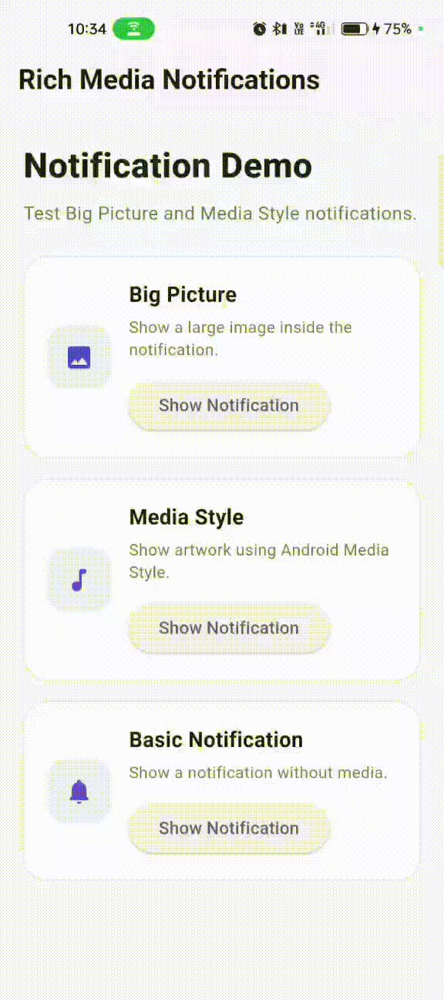

A production-ready Flutter package for creating rich Android notifications with **Big Picture Style**, **Media Style**, and **Basic Notifications**.


<p align="center">
  <strong>Rich Android notifications made simple with Flutter.</strong>
</p>

---

## Features

* ✅ Basic Android notifications
* ✅ Big Picture Style notifications
* ✅ Media Style notifications
* ✅ Image support
* ✅ GIF/media-ready notification architecture
* ✅ Automatic notification image loading
* ✅ Local asset support
* ✅ Android notification permission handling
* ✅ Notification cancellation
* ✅ Cancel all notifications
* ✅ Reusable notification service
* ✅ Clean package structure
* ✅ Easy Flutter integration

---
Demo GIF 
<p align="center">
  
</p>

```

The demo GIF shows the package running with rich notification examples.

---

## Supported Notification Styles

### Basic Notification

Displays a standard Android notification with a title and message.

### Big Picture Notification

Displays a large image inside the Android notification.

### Media Style Notification

Displays media-style notification content with artwork.

---

## Installation

Add the package to your Flutter project:

```bash
flutter pub add flutter_rich_media_notifications
```

Then run:

```bash
flutter pub get
```

---

## Android Configuration

This package uses Android notification APIs through `flutter_local_notifications`.

Open:

```text
android/app/build.gradle.kts
```

Make sure core library desugaring is enabled:

```kotlin
android {
    compileOptions {
        isCoreLibraryDesugaringEnabled = true
    }
}
```

Add the desugaring dependency:

```kotlin
dependencies {
    coreLibraryDesugaring("com.android.tools:desugar_jdk_libs:2.1.5")
}
```

---

## Android Notification Permission

Android notification permission is requested automatically when the notification service is initialized.

```dart
await RichNotificationService.initialize();
```

---

## Basic Usage

Import the package:

```dart
import 'package:flutter_rich_media_notifications/flutter_rich_media_notifications.dart';
```

Initialize the notification service:

```dart
await RichNotificationService.initialize();
```

Create a notification:

```dart
const notification = RichNotificationModel(
  title: 'Hello!',
  message: 'This is a rich notification.',
);
```

Show it:

```dart
await RichNotificationService.showBasic(
  notification: notification,
  id: 1,
);
```

---

## Big Picture Notification

Create a Big Picture notification:

```dart
const notification = RichNotificationModel(
  title: 'Beautiful Image',
  message: 'This is a Big Picture notification.',
  mediaType: RichNotificationMediaType.image,
  style: RichNotificationStyle.bigPicture,
);
```

Show the notification:

```dart
await RichNotificationService.show(
  notification: notification,
  id: 1,
);
```

The notification displays the configured image using Android Big Picture Style.

---

## Media Style Notification

Create a Media Style notification:

```dart
const notification = RichNotificationModel(
  title: 'Now Playing',
  message: 'Rich media notification is playing.',
  mediaType: RichNotificationMediaType.image,
  style: RichNotificationStyle.media,
);
```

Show it:

```dart
await RichNotificationService.show(
  notification: notification,
  id: 2,
);
```

---

## Complete Example

```dart
import 'package:flutter/material.dart';
import 'package:flutter_rich_media_notifications/flutter_rich_media_notifications.dart';

void main() {
  WidgetsFlutterBinding.ensureInitialized();
  runApp(const MyApp());
}

class MyApp extends StatelessWidget {
  const MyApp({super.key});

  @override
  Widget build(BuildContext context) {
    return MaterialApp(
      debugShowCheckedModeBanner: false,
      home: Scaffold(
        appBar: AppBar(
          title: const Text('Rich Notifications'),
        ),
        body: Center(
          child: ElevatedButton(
            onPressed: () async {
              await RichNotificationService.initialize();

              const notification = RichNotificationModel(
                title: 'Beautiful Image',
                message: 'This is a Big Picture notification.',
                mediaType: RichNotificationMediaType.image,
                style: RichNotificationStyle.bigPicture,
              );

              await RichNotificationService.show(
                notification: notification,
                id: 1,
              );
            },
            child: const Text('Show Notification'),
          ),
        ),
      ),
    );
  }
}
```

---

## Cancel Notification

Cancel a specific notification:

```dart
await RichNotificationService.cancel(1);
```

---

## Cancel All Notifications

Cancel all notifications created by the service:

```dart
await RichNotificationService.cancelAll();
```

---

## API Overview

### `RichNotificationService.initialize()`

Initializes the notification plugin and requests Android notification permission.

```dart
await RichNotificationService.initialize();
```

### `RichNotificationService.showBasic()`

Displays a basic notification.

```dart
await RichNotificationService.showBasic(
  notification: notification,
  id: 1,
);
```

### `RichNotificationService.show()`

Displays a notification according to the configured notification style.

```dart
await RichNotificationService.show(
  notification: notification,
  id: 1,
);
```

### `RichNotificationService.showBigPicture()`

Displays a Big Picture notification.

```dart
await RichNotificationService.showBigPicture(
  notification: notification,
  id: 1,
);
```

### `RichNotificationService.showMedia()`

Displays a Media Style notification.

```dart
await RichNotificationService.showMedia(
  notification: notification,
  id: 2,
);
```

### `RichNotificationService.cancel()`

Cancels a notification by ID.

```dart
await RichNotificationService.cancel(1);
```

### `RichNotificationService.cancelAll()`

Cancels all notifications.

```dart
await RichNotificationService.cancelAll();
```

---

## Notification Model

The package provides:

```dart
RichNotificationModel
```

Example:

```dart
const notification = RichNotificationModel(
  title: 'Notification Title',
  message: 'Notification message',
  mediaType: RichNotificationMediaType.image,
  style: RichNotificationStyle.bigPicture,
);
```

---

## Notification Styles

```dart
RichNotificationStyle.bigPicture
```

Used for large image notifications.

```dart
RichNotificationStyle.media
```

Used for Media Style notifications.

---

## Media Types

```dart
RichNotificationMediaType.image
```

Used for image-based rich notifications.

---

## Project Structure

```text
flutter_rich_media_notifications/
│
├── assets/
│   └── demo.gif
│
├── example/
│   ├── android/
│   ├── assets/
│   │   └── images/
│   │       └── notification_img.png
│   ├── lib/
│   │   └── main.dart
│   └── pubspec.yaml
│
├── lib/
│   ├── flutter_rich_media_notifications.dart
│   └── src/
│       ├── models/
│       │   └── rich_notification_model.dart
│       │
│       ├── services/
│       │   └── rich_notification_service.dart
│       │
│       └── widgets/
│           └── rich_notification.dart
│
├── test/
│
├── .gitignore
├── CHANGELOG.md
├── LICENSE
├── README.md
├── analysis_options.yaml
└── pubspec.yaml
```

---

## Example App

The package includes an example application demonstrating:

* Basic Notifications
* Big Picture Notifications
* Media Style Notifications
* Rich notification images
* Android notification permissions

Run the example:

```bash
cd example
flutter pub get
flutter run
```

For Android device testing:

```bash
flutter devices
```

Then:

```bash
flutter run
```

---

## Testing

Run package tests from the package root:

```bash
flutter test
```

Run static analysis:

```bash
flutter analyze
```

Expected result:

```text
No issues found!
```

---

## Build Example APK

From the example directory:

```bash
cd example
flutter build apk
```

The generated APK will be available under:

```text
example/build/app/outputs/flutter-apk/
```

---

## Requirements

* Flutter 3.41.9 or compatible
* Dart 3.11.5 or compatible
* Android SDK
* Android device or emulator for notification testing

> Rich Android notifications should be tested on an Android device or emulator. Chrome and Windows do not provide the same Android notification functionality.

---

## Dependencies

This package uses:

* `flutter_local_notifications`
* `path_provider`

Flutter SDK:

```yaml
flutter:
  sdk: flutter
```

---

## Development

Clone the repository:

```bash
git clone https://github.com/sufiyanshaikh-1304/flutter_rich_media_notifications.git
```

Enter the project:

```bash
cd flutter_rich_media_notifications
```

Install dependencies:

```bash
flutter pub get
```

Run tests:

```bash
flutter test
```

Run analysis:

```bash
flutter analyze
```

---

## Git Branches

The repository uses the following branches:

```text
master
stage
development
```

### Stage

Main development branch for current package work.

### Development

Development and feature integration branch.

### Master

Stable package branch.

---

## License

This project is licensed under the MIT License.

Copyright (c) 2026 Excelsior Technologies

Permission is hereby granted, free of charge, to any person obtaining a copy
of this software and associated documentation files, to deal in the Software
without restriction, including without limitation the rights to use, copy,
modify, merge, publish, distribute, sublicense, and/or sell copies of the
Software, and to permit persons to whom the Software is furnished to do so,
subject to the following conditions:

The above copyright notice and this permission notice shall be included in all
copies or substantial portions of the Software.

THE SOFTWARE IS PROVIDED "AS IS", WITHOUT WARRANTY OF ANY KIND, EXPRESS OR
IMPLIED, INCLUDING BUT NOT LIMITED TO THE WARRANTIES OF MERCHANTABILITY,
FITNESS FOR A PARTICULAR PURPOSE AND NONINFRINGEMENT. IN NO EVENT SHALL THE
AUTHORS OR COPYRIGHT HOLDERS BE LIABLE FOR ANY CLAIM, DAMAGES OR OTHER
LIABILITY, WHETHER IN AN ACTION OF CONTRACT, TORT OR OTHERWISE, ARISING FROM,
OUT OF OR IN CONNECTION WITH THE SOFTWARE OR THE USE OR OTHER DEALINGS IN THE
SOFTWARE.

---

## Author

**Sufiyan Shaikh**

Flutter Developer

---

## Repository

<p align="center">
  <a href="https://github.com/sufiyanshaikh-1304/flutter_rich_media_notifications">
    GitHub Repository
  </a>
</p>

---

<p align="center">
  Made with Flutter ❤️
</p>
